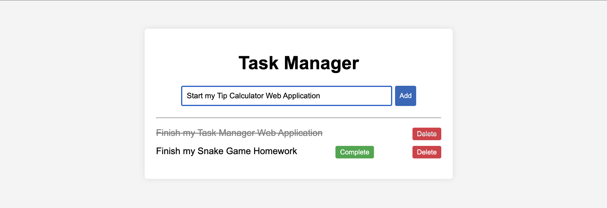

# Task Manager Web App

Task Manager is a simple **full-stack task management application** built with **Flask** (Python), **SQLite** (database), and **HTML/CSS** (frontend).  
This project demonstrates CRUD functionality (Create, Read, Update, Delete) with a persistent backend, clean UI, and professional code documentation.

---

## Features

- Add tasks  
- Mark tasks as complete (with strikethrough styling)  
- Delete tasks  
- Data persistence with SQLite (tasks remain after restart)  
- Clean and responsive interface with custom CSS styling  
- Well-documented code with comments for learning and collaboration  

---

## Project Structure
```
task-manager-webapp/
│── app.py # Flask backend with routes
│── init_db.py # Initializes SQLite database
│── tasks.db # SQLite database file
│── requirements.txt # Python dependencies
│── README.md # Project documentation
│
├── templates/ # HTML templates
│ ├── base.html # Layout template
│ └── index.html # Main task manager UI
│
├── static/ # Static files
│ └── style.css # Custom styling
```

---

## Installation & Setup

1. **Clone the repository**
   ```bash
   git clone https://github.com/your-username/task-manager-webapp.git
   cd task-manager-webapp

2. **Create a virtual environment**
    ```bash
    python3 -m venv venv
    source venv/bin/activate   # For Mac/Linux
    venv\Scripts\activate      # For Windows

3. **Install dependencies**
    ```bash
    pip install -r requirements.txt

4. **Initialize the database**
    ```bash
    python init_db.py

5. **Run the application**
    ```bash
    python app.py

6. **Open the app in your browser**
    Go to: http://127.0.0.1:5000

    > NOTE: If port 5000 is already in use, Flask may run on another port (e.g., 5001). Check your terminal output to confirm.

## Sample Output


## Live Demo
Check out the running app here: [Task Manager on Render](https://task-manager-webapp-23og.onrender.com)

## Technologies Used

- Backend: Flask (Python)
- Database: SQLite
- Frontend: HTML, CSS, Jinja2 Templates
- Tools: Git, VS Code

